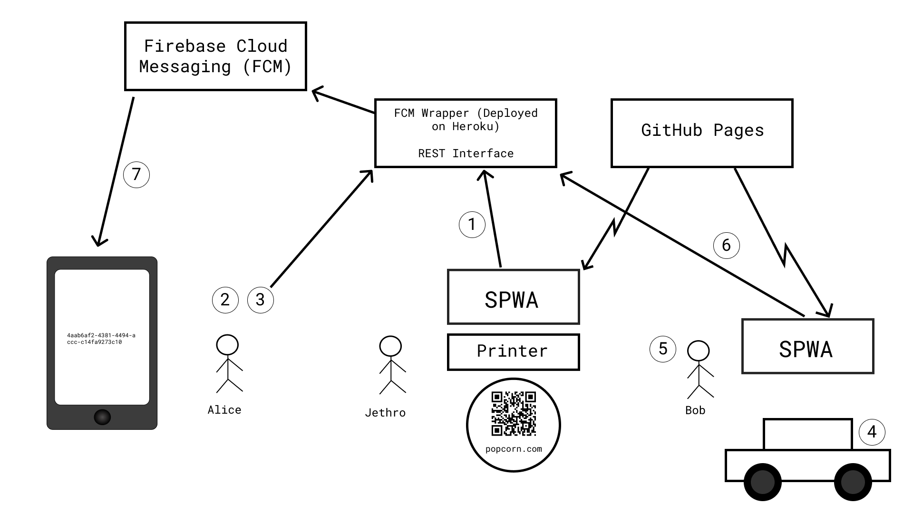
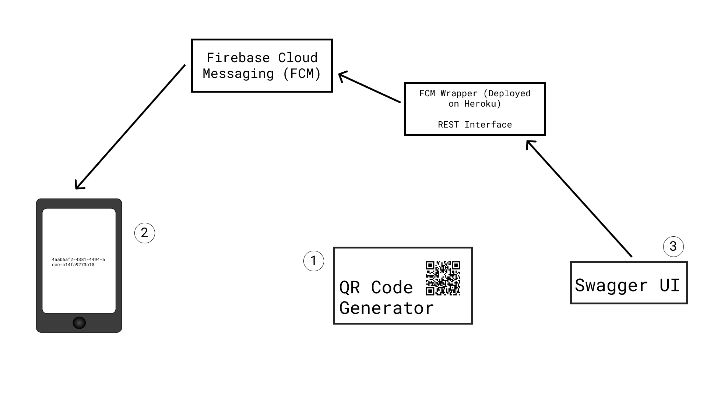

# THIS RESPOSITORY IS NOW PUBLIC

In `code/investigations/` are two projects. They are the yin and yang, the fore and aft, the salt and vinegar, of a key exchange framework using push messaging.

## Context



> A summary of how the SYCPE system will be used.

1. Jethro gets the stickers
2. Alice buys the stickers, from Jethro
3. Alice scans the stickers, using the app.
4. Alice puts a sticker on Bob's car
5. Bob scans the sticker on his car
6. Bob apologizes to Alice
7. Alice gets the apology from Bob

> Details

1. Jethro has access to the SPWA and a printer. The SPWA is served from GitHub pages. Jethro sends a request to the FCM Wrapper from the SPWA. The SPWA recieves a response from the FCM Wrapper. The reponse contains the UUIDs. The SPWA turns the UUIDs into QR codes which Jethro can then print as stickers. The stickers will contain a QR code and a URL to the SPWA. The QR code will contain the URL to the SPWA as well, however, the URL to the SPWA in the QR code will have the UUID as a query parameter whereas the URL to the SPWA printed in plain text underneath the QR code, will not have the UUID as a query parameter.
```
// In QR Code (For Example)
https://popcorn.com/incidents?uuid=3bc01afd-62b7-4c9a-9765-e9e5b7da5a93
```
2. Alice buys the stickers, from Jethro.
3. Alice scans the QR code on **each** sticker which registers the incident on the cloud service using the UUID in the QR code. The stickers are now ready to be placed on the cars of people who have parked there car in manner that is causing Alice some kind of distress.
4. Alice puts a sticker on Bob's car because Bob has been a jerk and has parked his car somewhere he shouldn't park it.
5. Bob scans the sticker on his car, using his phone's QR Scanner or app equivalent which will take him to the SPWA where he can choose to apologize or ignore. If his phone doesn't have a QR Scanner, he can enter the URL on the sticker which will also take him to the SPWA. He can then scan the QR code on the sticker using the SPWA which will then ask him if he wants to apologize or ignore.
6. Bob decides to apologize to Alice and presses the button that says "Apologize" on the SPWA. This will send a message to the cloud service using the UUID to identify the incident. The FCM Wrapper will handle everything regarding telling Google's Firebase Cloud Messaging to send a notification to Alice's phone in which there is the app which she used to scan all the stickers.
7. Alice gets the apology from Bob.



> How to use the demo

1. Generate a QR code. This contains a UUID.
2. Using the app register with FCM. Scan the QR code. This creates a [publish and subscribe](https://en.wikipedia.org/wiki/Publish%E2%80%93subscribe_pattern) topic on FCM with the UUID.
3. Copy the UUID from the phone to the Swagger UI. Send a message to the phone, using the UUID to identify the publish and subscribe topic.

> Details

1. Launch the [QR code generator](https://github.com/AliceDigitalLabs/SYCPE-PushDemo/tree/master/code/investigations/SYCPE-QR-Dummy) by following the instructions at [SYCPE_QR_Dummy](https://github.com/AliceDigitalLabs/SYCPE-PushDemo#sycpe-qr-dummy). Once you have launched it, you will see a QR code which is a UUID that is ready to be scanned. This takes the place of the stickers from Jethro in the first diagram.
2. Run the [demo app](https://github.com/AliceDigitalLabs/SYCPE-PushDemo/tree/master/code/investigations/SYCPE-Starter) on an Android device by following the instructions at [SYCPE_Starter](https://github.com/AliceDigitalLabs/SYCPE-PushDemo#sycpe-starter). Once you have launched it, you will see that the app is trying to connect to the **FCM Wrapper**. If the app is taking a while to connect to the **FCM Wrapper** then you can press the **retry button** to try and connect again. Once the app tells you that you are connected, press the button that says "**Scan QR Code**" to start the QR code scanner. Then proceed to scan the QR code. Once you have scanned it, the app will **display the uuid** and tell you whether it has **subscribed to the topic that is the uuid**.
3. Go to the [Swagger UI](https://rescuestationpush.herokuapp.com/docs) for the **FCM Wrapper** to send an "**apology**" to Alice (test app). Don't worry if it takes a minute to load, heroku's server needs to wake up as it falls asleep if no one uses it for a while. Follow the instructions at [Testing using the Swagger API](https://github.com/AliceDigitalLabs/SYCPE-PushDemo#testing-using-the-swagger-api) to send the "**apology**" to Alice (test app).

## SYCPE-QR-Dummy

From the terminal, issue the command

`cordova run`

This will open a browser (in all likelihood sending your data without your tacit permission to Google) and show a QR Code, which is a textual UUID. This UUID is displayed as text above the QR Code image.

## SYCPE-Starter

This is a simple Cordova Android project which signs in to Firebase Cloud Messaging.

Build it for an Android device with the terminal command

`cordova run android --device`

(it is not supported on iOS or any other platform).

If it cannot successfully sign in to FCM, there will be a 'retry' button at the top of the interface - tap it to try again, the application is fairly useless without a successful sign-in.

After this, tap 'Scan QR Code' to scan a QR code as provided from `SYCPE-QR-Dummy`. The text of this code will be subscribed to as a *topic* from Firebase Cloud Messaging.

If a message is posted to this topic using a combination of the FCM console and a HTTP Post tool, it will be picked up by the application and displayed as a JavaScript `alert()`.

## Testing using VSCode

You will need the *vscode-http-client* extension for VSCode to run this test. This will allow you to send a message to all devices subscribed to a single topic.

Because of the need to embed a *server_key*, you will need to communicate through a secured network-based server to handle the actual sending of messages; through this can be done on a device (as it is ultimately a HTTP request), it requires embedding this key in the app, which is a huge security hole.

Using the Swagger API gives us this internet-hosted middleware and means we do not have to worry about securing the key.

At the end of this document is an example of what happens to interact directly with the FCM server - this is provided to show the communications at a low-level, and should *never* be used from a client due to the security issues discussed above.

### Testing using the Swagger API

Go to https://rescuestationpush.herokuapp.com/docs/

Click on `Message` and then click on the green field that says `POST /messages`

Use the following as a skeleton for the `body` field.

```json
{
  "recipient_id":"/topics/TOPIC_ID",
  "sender_id": "",
  "message_id": "",
  "message_type": 0,
  "sender_role": 0,
  "payload": "{\"any-old-data\":\"any-any-any-old-data\"}"
}
```

Replace **TOPIC_ID** with the UUID you created earlier (*watch out for case sensitivity!*).

Press the `Try it out!` button to send the message. You will recieve a message on your phone.

This will send any payload you care to the recipient device(s) that are subscribed to the specified topic. The `payload` is the field that will carry your data through, and though you can put a set of keys and values (even nested ones), you will need to be sure you encode them correctly and escape inline quotes (which will be necessary) with backslashes.

### Testing using direct FCM interaction

You will need the Firebase Cloud Messaging Server Key, which can be gotten from the FCM Console, under `Settings`->`Cloud Messaging` tab, as `Server Key` (remember to never release this key to a public location, as you cannot generate a new one - you will need to create a new application!)

In the VSide *vscode-http-client*, set the following properties:

#### Request Settings

Parameter | Value
----------|--------
URL| `https://fcm.googleapis.com/fcm/send`
Body | `{"message":"hello", "title":"Hello There", "to":"/topics/`*topic_id*`"}`

Where *topic_id* is the UUID generated earlier, in the form of something like *2a4abbfc-13be-4253-83b5-a899cce8b89a*. Be aware this is case sensitive!

#### Custom Headers

Name | Value
-----|--------
Content-Type | `application/json`
Authorization | `key=`*FCM_key*

Where *FCM_key* is the Firebase Cloud Messaging Server Key taken from the Firebase console earlier.

**WARNING** To avoid creating a new stack of infrastructure, this application is internally (in the `config.xml` file) named as `uk.ac.mmu.digitallabs.rs.acknack` - do not rename the application as there will need to be a new `google-services.json` file created, which will issue a new server key, which will require a new Heroku instance setting up, configuring and deploying.

You may also find devices with an application with the *same name* but *different functionality* are in DigitalLabs. You may need to uninstall the other app to be able to deploy this one properly.
